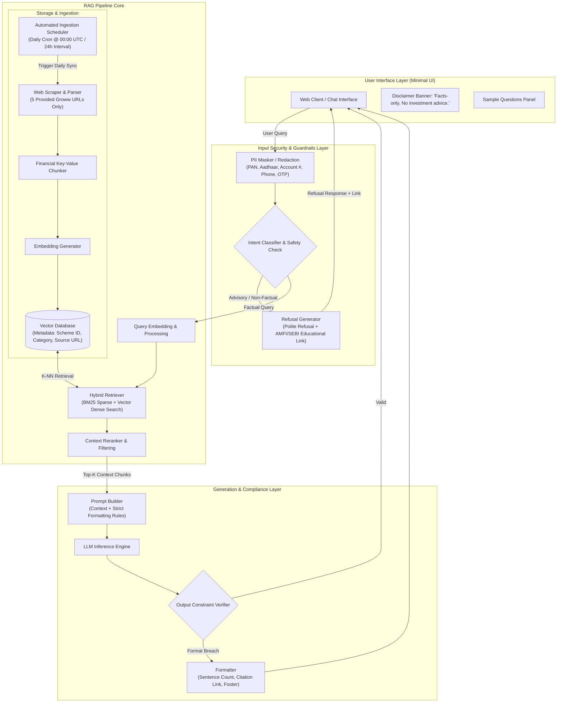
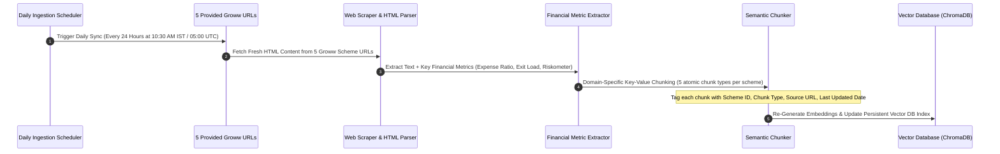
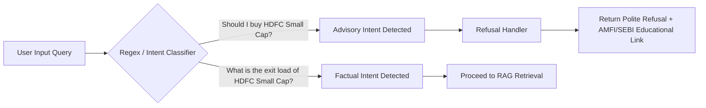
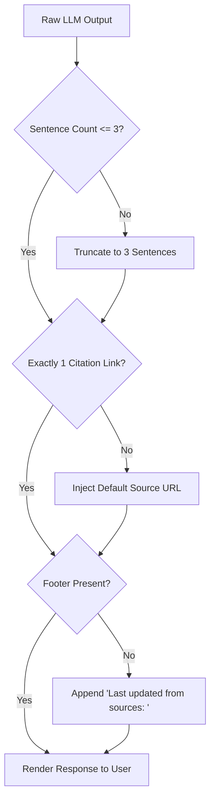

# System Architecture: Mutual Fund Facts-Only FAQ Assistant (RAG Pipeline)

## 1. Executive Summary & Overview

The **Mutual Fund FAQ Assistant** is a specialized, compliance-first Retrieval-Augmented Generation (RAG) system. Built with reference to **Groww** as the product context, it provides factual, source-backed answers for **HDFC Mutual Fund** schemes while strictly prohibiting investment advice, financial recommendations, or speculative performance claims.

### Core Architecture Goals
* **Grounded Precision**: Answers derived exclusively from the 5 provided Groww scheme detail URLs.
* **Deterministic Guardrails**: Pre-retrieval query classification to filter out investment advice and mask PII (PAN, Aadhaar, Account Numbers, OTPs).
* **Strict Format Enforcement**: Every answer is capped at **maximum 3 sentences**, includes **exactly 1 citation link**, and features a standardized timestamped footer.
* **Refusal Handling**: Automatic redirection to educational resources (AMFI/SEBI) when advisory or out-of-scope queries are detected.

---

## 2. End-to-End System Architecture



---

## 3. Data Ingestion & Vector Indexing Architecture



### Ingestion Details
1. **Target Corpus Coverage (HDFC AMC)**:
   * `HDFC Gold ETF Fund of Fund Direct Plan Growth` (Commodity FoF)
   * `HDFC Large Cap Fund Direct Growth` (Equity Large Cap)
   * `HDFC Small Cap Fund Direct Growth` (Equity Small Cap)
   * `HDFC Silver ETF FoF Direct Growth` (Commodity FoF)
   * `HDFC Mid Cap Fund Direct Growth` (Equity Mid Cap)
2. **Metadata Payload Schema**:
   ```json
   {
     "scheme_id": "hdfc-large-cap-fund-direct-growth",
     "scheme_name": "HDFC Large Cap Fund Direct Growth",
     "category": "Equity - Large Cap",
     "source_url": "https://groww.in/mutual-funds/hdfc-large-cap-fund-direct-growth",
     "doc_type": "groww_page",
     "last_updated": "2026-08-27"
   }
   ```

---

## 4. Query Pipeline & Guardrails Flow

### Stage 1: PII Redaction & Security Engine
Before query analysis, user input passes through regex and NER models to detect and sanitize:
* **PAN**: `[A-Z]{5}[0-9]{4}[A-Z]{1}`
* **Aadhaar**: `\d{4}\s?\d{4}\s?\d{4}`
* **Bank / Demat Account Numbers**: `\d{9,18}`
* **OTPs / Passwords**: 4-6 digit numeric sequences in sensitive context.

### Stage 2: Intent Classification & Advisory Guardrail
A lightweight classifier categorizes queries into two buckets:

| Category | Description | System Action |
| :--- | :--- | :--- |
| **FACTUAL** | Specific queries on Expense Ratio, Exit Load, Minimum SIP, Riskometer, Benchmark, Statement Downloads | Route to Hybrid Retrieval |
| **ADVISORY / SPECULATIVE** | Queries asking for stock recommendations, comparison opinions ("Which is better?"), return forecasts | Trigger Refusal Engine |



---

## 5. Retrieval & Generation Pipeline

### Hybrid Search Strategy
To maximize accuracy for specific financial terms (e.g., "minimum SIP", "exit load"):
1. **BM25 Sparse Search**: Matches exact keywords and scheme titles.
2. **Vector Dense Search**: Captures semantic query meaning using cosine similarity.
3. **Reciprocal Rank Fusion (RRF)**: Combines scores to retrieve top **K=3** relevant document chunks.

### Generation & Prompt Constraints
The system prompt enforces strict output constraints:

```text
You are a facts-only Mutual Fund FAQ Assistant for HDFC Mutual Fund schemes.
CRITICAL CONSTRAINTS:
1. Answer strictly using ONLY the provided context. Do NOT add advice, opinions, or forecasts.
2. The response MUST BE AT MOST 3 SENTENCES long.
3. Include EXACTLY ONE source citation link formatted as [Source](<URL>).
4. Append a footer line at the end: "Last updated from sources: <date>".
```

---

## 6. Output Verification & Formatting Engine

Every LLM response undergoes post-processing validation before rendering to the client:



---

## 7. Minimal User Interface Architecture

The minimal UI provides an intuitive, clean interface adhering to strict non-advisory compliance.

### Interface Layout Blueprint
```
+-----------------------------------------------------------------------+
|  MUTUAL FUND FAQ ASSISTANT (HDFC SCHEMES)                              |
|  [!] Disclaimer: Facts-only. No investment advice.                     |
+-----------------------------------------------------------------------+
| Welcome! Ask factual questions about HDFC Mutual Fund schemes.        |
|                                                                       |
| Try sample questions:                                                 |
| 1. "What is the expense ratio of HDFC Large Cap Fund?"               |
| 2. "How to download capital gains statement?"                         |
| 3. "What is the exit load for HDFC Small Cap Fund?"                   |
+-----------------------------------------------------------------------+
| User: What is the exit load for HDFC Small Cap Fund Direct Growth?    |
|                                                                       |
| Assistant: The exit load for HDFC Small Cap Fund Direct Growth is 1%   |
| if redeemed within 1 year from the date of allotment. No exit load    |
| applies for redemptions made after 1 year.                            |
| Source: https://groww.in/mutual-funds/hdfc-small-cap-fund-direct-growth|
| Last updated from sources: 2026-08-27                                 |
+-----------------------------------------------------------------------+
| [ Type your question here...                                ] [Send]  |
+-----------------------------------------------------------------------+
```

---

## 8. Summary Matrix: Component Responsibilities

| Subsystem | Key Technology / Method | Responsibility |
| :--- | :--- | :--- |
| **Scraper & Ingestion** | BeautifulSoup4 / Playwright | Ingest HTML content exclusively from the 5 provided Groww URLs |
| **Ingestion Scheduler** | `ingestion/scheduler.py` (`APScheduler` / Background Cron Daemon) | Trigger daily scraping, chunking, and ChromaDB vector store re-indexing (every 24h at 00:00 UTC) |
| **Embedding Engine** | BAAI BGE Model (`BAAI/bge-small-en-v1.5`) | Convert document chunks & queries into dense vectors |
| **Vector Database** | ChromaDB (`hnsw:space = cosine`) | Store 384-dim chunks with rich metadata for filtered vector retrieval |
| **Security Guardrail** | Regex + PII Redactor | Strip PAN, Aadhaar, Account numbers, Phone, Email, and OTPs |
| **Advisory Guardrail** | Intent Classifier + Refusal Handler | Intercept advisory queries & issue structured refusals + AMFI educational link |
| **Hybrid Retriever** | BM25 + Vector Cosine Similarity (RRF $K=3$) | Retrieve accurate context chunks for scheme queries |
| **LLM Inference Engine** | Groq API (`llama-3.3-70b-versatile`) + Grounded Fallback | High-speed LLM generation strictly bounded by retrieved context |
| **Compliance Formatter** | Output Validation Pipeline | Enforce 3-sentence limit, 1 citation link, and standard footer |
| **Frontend UI** | Streamlit (`ui/app.py`) + Dark Glassmorphism CSS | Minimal UI with permanent disclaimer banner & sample prompts |
